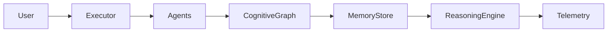

# AxiomCore Cognitive Architecture

The cognitive runtime extends the executor layer with a shared graph, memory, and reasoning surface that agents can use to store, query, and infer knowledge. The runtime is available to agents through the executor-provided `context` object and is instrumented with telemetry and governance logging.

## Components
- **KnowledgeGraph**: Lightweight in-memory graph for nodes and edges with query, neighbor lookup, and audit/metric tracking.
- **MemoryStore**: Agent-scoped memory entries persisted in-memory for quick recall.
- **ReasoningEngine**: Performs relationship discovery, rule-based inference, and path finding across the graph and stored memories.
- **Runtime Context**: Injected into agents via the executor as `env.context`, exposing `graph`, `memory`, and `reasoning`.

## Flow

## Usage Patterns
- Add or update knowledge: `context.graph.addNode({...})`, `context.graph.addEdge({...})`
- Ask questions: `context.graph.query({...})`, `context.graph.getNeighbors(nodeId)`
- Reasoning and inference: `context.reasoning.findRelationships(nodeId)`, `context.reasoning.findPath(a, b)`, `context.reasoning.inferAssociations(seedId, relation?)`
- Persist agent memory: `context.memory.saveMemory(agentId, entry)`

All operations emit governance logs through `AuditLogger` and metrics via `MetricsRecorder` for observability.
