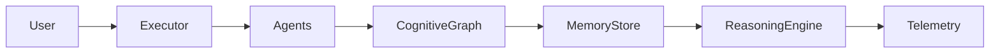

# AxiomCore Cognitive Runtime

The cognitive runtime introduces a shared knowledge layer that every agent can use through the executor context. Agents can add nodes and edges to the knowledge graph, persist episodic memory, and invoke lightweight reasoning routines for discovery and inference.

## Components
- **KnowledgeGraph**: Typed nodes and edges with query and neighbor traversal helpers, audited and metered.
- **MemoryStore**: Agent-scoped in-memory log of observations and facts.
- **ReasoningEngine**: Performs relationship discovery, rule-based inference, and path finding across the shared graph.
- **Runtime Context**: The `AgentExecutor` now injects `context.graph`, `context.memoryStore`, and `context.reasoning` so any agent can use the shared layer.
- **Telemetry & Governance**: Every cognitive operation records metrics via `MetricsRecorder` and audit events via `AuditLogger`.

## Data Flow

## Usage Example
- Add a node: `context.graph.addNode({ id: "user:1", type: "profile" })`
- Link entities: `context.graph.addEdge({ from: "user:1", to: "order:99", relation: "purchased" })`
- Query neighbors: `context.graph.query({ neighborOf: "user:1" })`
- Persist memory: `context.memoryStore.saveMemory("MyAgent", { timestamp: Date.now(), data })`
- Discover path: `context.reasoning.findPath("user:1", "order:99")`
