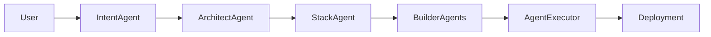

# AxiomCore Universal Project Generator

The Project Generator assembles full-stack templates across industries using an agentic pipeline that converts intent into architecture, stack selection, scaffolding, and deployment assets.

## Pipeline
1. **IntentAgent** parses user intent into structured JSON.
2. **ArchitectAgent** maps intent to system architecture using industry templates.
3. **StackAgent** chooses frameworks, database, and messaging.
4. **BuilderAgents** (Backend, Frontend, ML, DevOps) generate scaffolding outputs.
5. **AgentExecutor** orchestrates all stages with retries, scheduling, telemetry, and audit logging.



## Templates
Templates live in `runtime/project-generator/templates/*.yaml` and describe microservices, data models, ML modules, APIs, frontend components, and infrastructure. New industries can be added by dropping a new template file and invoking `axiom build <template>`.

## CLI
```
axiom build fintech
axiom build ai_platform "Launch an AI platform with training and inference"
axiom build smart_city
```

## Outputs
- `backend/` service scaffold
- `frontend/` React scaffold
- `ml/` pipelines and notebooks
- `infra/`, `docker/`, `ci/` DevOps assets

## Telemetry & Governance
Every stage records metrics (executions, errors) and audit events (agent, action, permission, details) via `MetricsRecorder` and `AuditLogger`.
