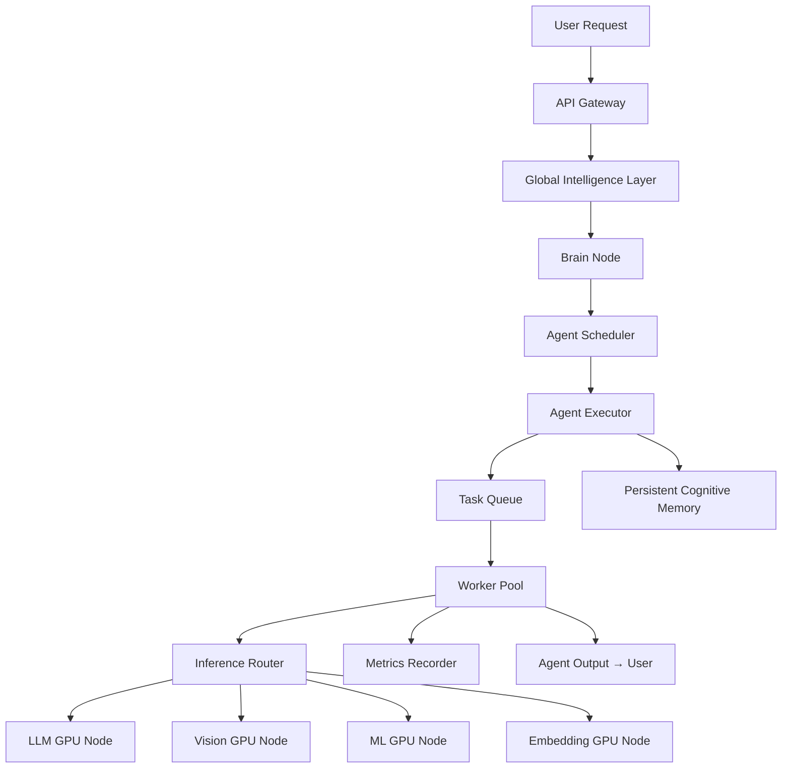

# Runtime Flow Diagram

```mermaid
flowchart TD
    User[User Request] --> API[API Gateway]
    API --> Meta[Global Intelligence Layer]
    Meta --> BrainNode[Brain Node]
    BrainNode --> Scheduler[Agent Scheduler]
    Scheduler --> Executor[Agent Executor]
    Executor --> Queue[Task Queue]
    Queue --> Worker[Worker Pool]
    Worker --> GPURouter[Inference Router]
    GPURouter --> LLMGPU[LLM GPU Node]
    GPURouter --> VisionGPU[Vision GPU Node]
    GPURouter --> MLGPU[ML GPU Node]
    GPURouter --> EmbGPU[Embedding GPU Node]
    Executor --> MemoryLayer[Persistent Cognitive Memory]
    Worker --> Telemetry[Metrics Recorder]
    Worker --> Response[Agent Output → User]
```
